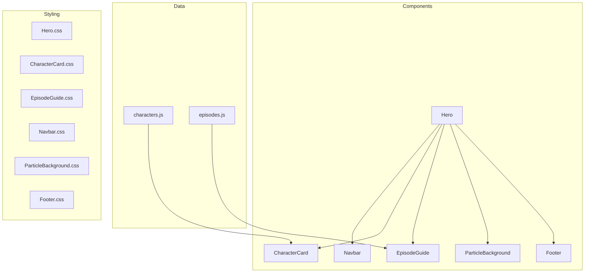

# 🕯️ Stranger Things Landing Page

[](LICENSE)
[](#)
[](https://react.dev/)
[](https://vitejs.dev/)

A premium, interactive landing page inspired by the hit Netflix series "Stranger Things". This project features a unique "Fire Reveal" effect that allows users to peer into the Upside Down using their mouse.

> 🎬 **[Live Demo](#)** | **[Watch on Netflix](https://www.netflix.com/title/80057281)**

---

## ✨ Features

- **The Upside Down Reveal**: Move your mouse across the screen to reveal the dark, flickering reality beneath.
- **Cinematic Animations**: Smooth, staggered entrance animations powered by `framer-motion`.
- **3D Character Cards**: Flip cards with character details, powers, and quotes.
- **Interactive Episode Guide**: Season tabs with expandable episode details.
- **Ambient Particle Effects**: Floating ember particles for atmospheric depth.
- **Stranger Aesthetics**: Custom typography and lighting effects that capture the 80s synth-wave and horror vibe.
- **Optimized Performance**: High-performance masking using `requestAnimationFrame` and CSS variables.
- **Fully Accessible**: ARIA labels, skip links, keyboard navigation, and reduced-motion support.

---

## 🏗️ Architecture



---

## 🛠️ Tech Stack

| Technology | Version | Purpose |
|------------|---------|---------|
| **React** | 19 | Component-based UI architecture |
| **Vite** | 7 | Lightning-fast build tool and dev server |
| **Framer Motion** | 12 | Smooth, physics-based animations |
| **Vitest** | 4 | Fast unit testing framework |
| **Testing Library** | 16 | React component testing utilities |

---

## 📦 Getting Started

### Prerequisites
- Node.js 18+ 
- npm or yarn

### Installation

1. **Install dependencies**
   ```bash
   npm install
   ```

3. **Run the development server**
   ```bash
   npm run dev
   ```

4. **Open your browser**
   Navigate to `http://localhost:5173`

---

## 🧪 Testing

Run the test suite:
```bash
npm test
```

Run tests with coverage:
```bash
npm run test:coverage
```

---

## 📁 Component API

### `<Hero />`
The main landing page component featuring the interactive fire reveal effect.

### `<CharacterCard character={} index={} />`
| Prop | Type | Description |
|------|------|-------------|
| `character` | `Object` | Character data (id, name, role, image, description, powers, quote) |
| `index` | `number` | Index for staggered animation delay |

### `<EpisodeGuide />`
Interactive episode guide with season tabs and expandable cards.

### `<Navbar />`
Fixed navigation bar with smooth scroll links.

### `<ParticleBackground />`
Ambient floating particle effects (CSS-only, performance optimized).

### `<Footer />`
Themed footer with Netflix attribution and credits.

---

## 🎨 Visual Magic

The "Fire Reveal" effect is achieved using dynamic CSS masking:
```css
mask-image: radial-gradient(circle 400px at var(--x) var(--y), ...);
```
Mouse coordinates are tracked and updated efficiently via a `ref` and CSS variables to prevent unnecessary re-renders.

---

## 📄 License

This project is licensed under the MIT License - see the [LICENSE](LICENSE) file for details.

---

## 🤝 Contributing

Contributions are welcome! Please see [CONTRIBUTING.md](CONTRIBUTING.md) for guidelines.

---

Developed with ❤️ by Lohith S
